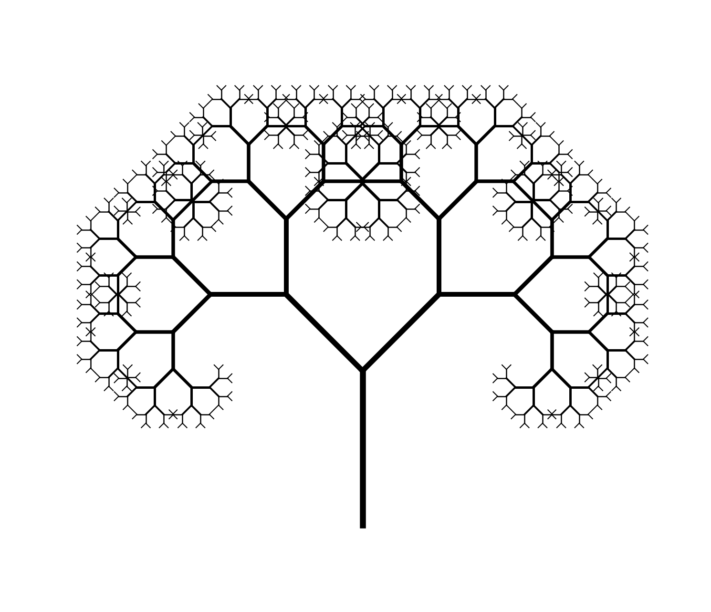

# GoIT Algorithm Final Project

## Завдання 1. Структури даних. Сортування. Робота з однозв'язним списком

### Опис
Реалізація операцій з однозв'язним списком (singly linked list):
- Реверсія списку шляхом зміни посилань між вузлами
- Сортування списку алгоритмом insertion sort
- Об'єднання двох відсортованих списків в один відсортований

### Реалізація
- `Node` - клас вузла списку
- `LinkedList` - клас однозв'язного списку з методами `append()`, `to_list()`, `from_list()`
- `reverse_list()` - реверсія списку (ітеративний підхід)
- `insertion_sort_list()` - сортування вставками
- `merge_sorted_lists()` - об'єднання двох відсортованих списків

### Запуск
```bash
python task1/main.py
```

### Приклад виводу
```
1. Реверсія:
До: [1, 2, 3, 4, 5]
Після: [5, 4, 3, 2, 1]

2. Сортування:
До: [4, 2, 1, 3, 5]
Після: [1, 2, 3, 4, 5]

3. Об'єднання відсортованих списків:
Список 1: [1, 3, 5]
Список 2: [2, 4, 6]
Об'єднаний: [1, 2, 3, 4, 5, 6]
```

### Складність
- **Реверсія**: O(n) за часом, O(1) за пам'яттю
- **Сортування вставками**: O(n^2) за часом, O(1) за пам'яттю
- **Об'єднання**: O(n + m) за часом, O(1) за пам'яттю (де n, m - довжини списків)

---

## Завдання 2. Рекурсія. Створення фрактала "Дерево Піфагора"

### Опис
Програма генерує фрактал "Дерево Піфагора" за допомогою рекурсії та візуалізує його за допомогою бібліотеки `turtle`. Користувач може вказати рівень рекурсії для контролю складності фракталу.



### Особливості
- Рекурсивна генерація фракталу
- Змінна ширина ліній: товстіші на початкових рівнях, тонші на глибоких
- Кожна гілка має кут 45(deg) і зменшується на 30% (коефіцієнт 0.7) на кожному рівні

### Запуск
```bash
python task2/main.py
```

### Параметри
- **Рівень рекурсії**: вводиться користувачем (за замовчуванням 5)
- **Початкова довжина**: 100 пікселів
- **Коефіцієнт зменшення**: 0.7
- **Кут розгалуження**: 45(deg)

### Алгоритм
1. Малюється вертикальна лінія (стовбур)
2. На кожному рівні рекурсії створюються дві гілки під кутом 45(deg)
3. Довжина гілок зменшується на 30% на кожному рівні
4. Процес повторюється до досягнення глибини 0

### Складність
- **Часова**: O(2^n), де n - рівень рекурсії
- **Просторова**: O(n) через стек рекурсивних викликів

---

## Завдання 3. Дерева, алгоритм Дейкстри

### Опис
Реалізація алгоритму Дейкстри для знаходження найкоротших шляхів у зваженому графі з використанням бінарної купи (піраміди). Алгоритм обчислює найкоротші відстані від початкової вершини до всіх інших вершин графа.

### Реалізація
- `dijkstra()` - алгоритм Дейкстри з використанням бінарної купи (`heapq`)
- `get_path()` - відновлення шляху від початкової до цільової вершини
- Граф представлений як словник, де ключі - вершини, значення - словники сусідів з вагами ребер

### Особливості
- Використання бінарної купи (min-heap) для оптимізації вибору вершин
- Автоматичне обчислення найкоротших шляхів до всіх вершин
- Відображення повних шляхів між вершинами

### Запуск
```bash
python task3/main.py
```

### Приклад виводу
```
==================================================
НАЙКОРОТШІ ШЛЯХИ ВІД 'A'
==================================================

A -> B:
  Відстань: 3
  Шлях: A -> C -> B

A -> C:
  Відстань: 2
  Шлях: A -> C

A -> D:
  Відстань: 8
  Шлях: A -> C -> B -> D

A -> E:
  Відстань: 10
  Шлях: A -> C -> B -> D -> E
```

### Складність
- **Часова**: O((V + E) log V), де V - кількість вершин, E - кількість ребер
- **Просторова**: O(V) для зберігання відстаней та купи
